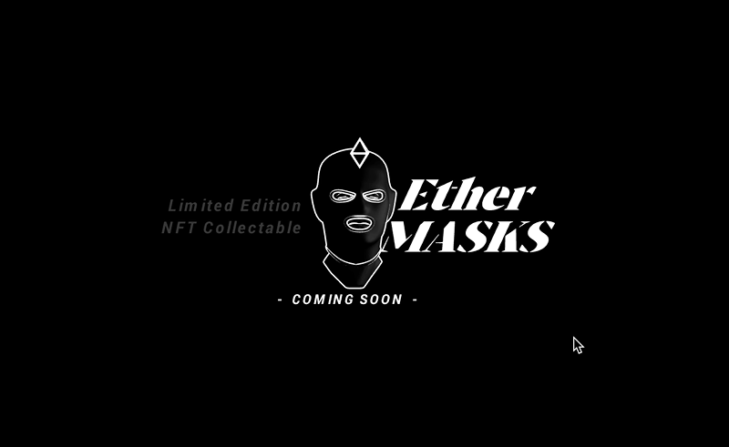

All made with <a href="https://spline.design/">spline.design</a> 
To tool to easily create and publish 3D web experiences.

# Spline Beats
  <a href="https://hannemaes.github.io/my-spline-designs/spline-exports/spline-beats/spline beats default/index.html">Spline Beats (Default)</a> 
  
  Alternative qualities: 
  <a href="https://hannemaes.github.io/my-spline-designs/spline-exports/spline-beats/spline beats high/index.html">Spline Beats (High)</a> 
  <a href="https://hannemaes.github.io/my-spline-designs/spline-exports/spline-beats/spline beats mid/index.html">Spline Beats (Mid)</a> 
  <a href="https://hannemaes.github.io/my-spline-designs/spline-exports/spline-beats/spline beats low/index.html">Spline Beats (Low)</a> 

# 3D Icons
  <a href="https://hannemaes.github.io/my-spline-designs/spline-exports/3d-icons/3D-Icons-default/index.html">3D Icons (Default)</a> 
  
  Alternative qualities: 
  <a href="https://hannemaes.github.io/my-spline-designs/spline-exports/3d-icons/3D-Icons-high/index.html">3D Icons (High)</a> 
  <a href="https://hannemaes.github.io/my-spline-designs/spline-exports/3d-icons/3D-Icons-mid/index.html">3D Icons (Mid)</a> 
  <a href="https://hannemaes.github.io/my-spline-designs/spline-exports/3d-icons/3D-Icons-low/index.html">3D Icons (Low)</a> 

# EtherMasks.com
  <a href="https://my.spline.design/ethermaskswebsite-032fd6fa28cfd07d3119a40a95dec636/">www.ethermasks.com</a>
  
